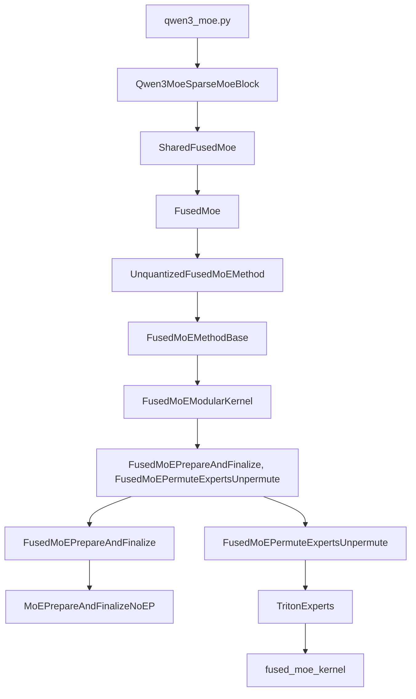

#### 调用链
vllm Version: 0.15.0
vllm调用moe模型最简单的一个调用链，vllm版本不同会不太一样，也可以直接让codex直接分析整个调用过程。

```mermaid
flowchart TD
    A[qwen3_moe.py] --> B[Qwen3MoeSparseMoeBlock]
    B --> C[SharedFusedMoe]
    C --> C1[FusedMoe]
    C1 --> D[UnquantizedFusedMoEMethod]
    D --> E[FusedMoEMethodBase]
    E --> F[FusedMoEModularKernel]
    F --> G[FusedMoEPrepareAndFinalize, FusedMoEPermuteExpertsUnpermute]
    G --> H[FusedMoEPrepareAndFinalize]
    G --> I[FusedMoEPermuteExpertsUnpermute]
    H --> J[MoEPrepareAndFinalizeNoEP]
    I --> K[TritonExperts]
    K --> L[fused_moe_kernel]
```